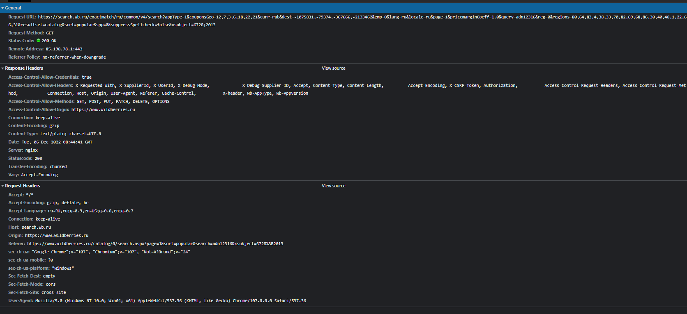
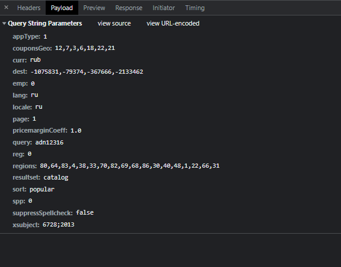
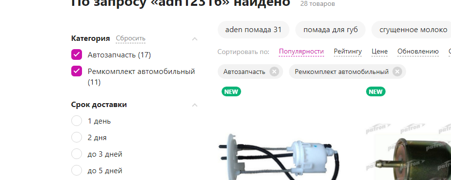
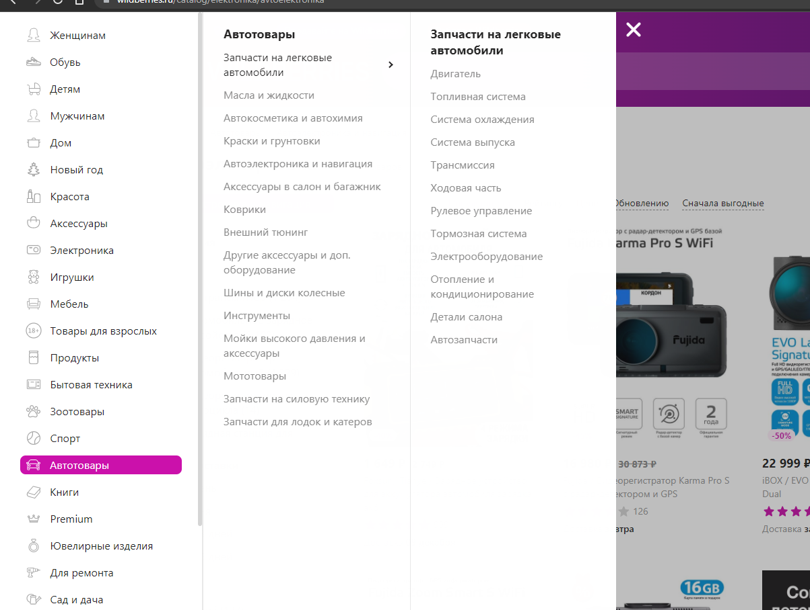
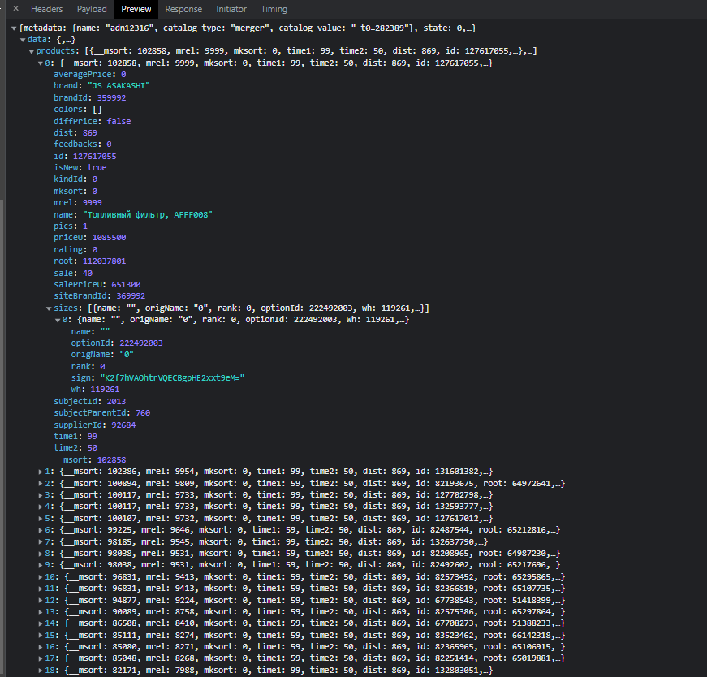
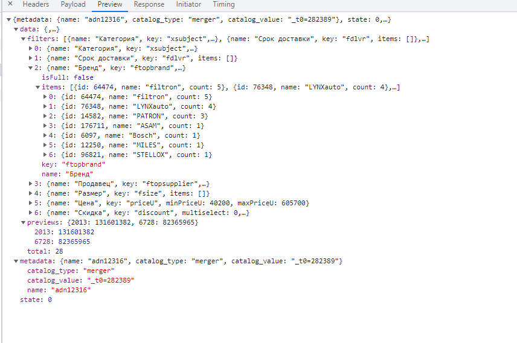
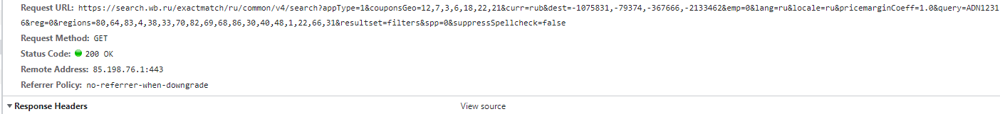

# Запрос на поиск товаров


# Payload запроса



### **Определение категорий**

- Категория товара передается в этом запросе. Поле называется ```xsubject```
- 6728 - это автозапчасть
- 2013 - Ремкомплект автомобилей


- Предлагаю выписать все номера категорий из каталога



# Сами данные


# Фильтры



# [Готовое решение на python](https://happypython.ru/2022/07/21/парсер-wildberries/)